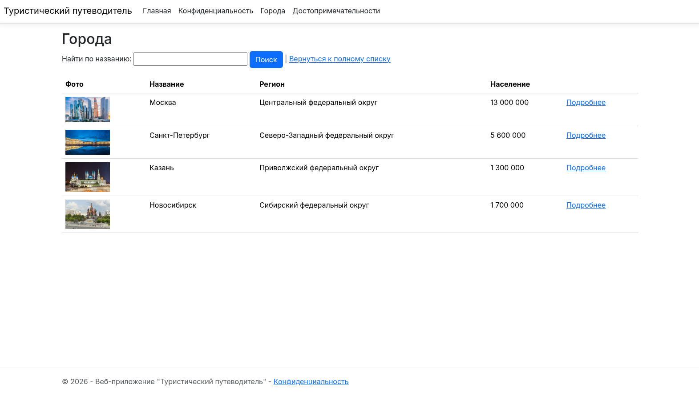

# Веб-приложение "Туристический путеводитель"

Это ASP.NET Core MVC веб-приложение, реализующее интерактивный туристический путеводитель. Пользователи могут просматривать информацию о различных городах и достопримечательностях.



## Функциональность

*   **Список городов:** Отображение списка доступных городов с названием, регионом, населением и фотографией.
*   **Поиск городов:** Возможность поиска городов по названию.
*   **Информация о городе:** Подробная страница для каждого города, включающая название, регион, население, историю, герб, фотографию и список достопримечательностей.
*   **Список достопримечательностей:** На странице города отображается список связанных с ним достопримечательностей.
*   **Информация о достопримечательности:** Подробная страница для достопримечательности, включающая название, историю, фотографию, часы работы и стоимость посещения (если указана).
*   **Интерфейс:** Интерфейс полностью на русском языке.

## Технологии

*   **Фреймворк:** ASP.NET Core MVC (.NET 9.0)
*   **ORM:** Entity Framework Core 8.0.11
*   **База данных:** SQLite (файл `TourismGuide.db`)
*   **Язык программирования:** C#
*   **Стилизация:** Bootstrap (через CDN и локальные CSS файлы)

## Требования

*   [.NET 9.0 SDK](https://dotnet.microsoft.com/download/dotnet/9.0) или выше
*   (Опционально) IDE или редактор кода (например, Visual Studio Code, Visual Studio, JetBrains Rider)

## Установка и запуск

1.  **Клонируйте репозиторий (или скачайте архив):**

    ```bash
    git clone https://github.com/ZenesDK/TourismGuide.Web
    cd TourismGuide.Web
    ```

2.  **Установите зависимости:**

    Убедитесь, что вы находитесь в директории `TourismGuide.Web` (где находится `TourismGuide.Web.csproj`), и выполните:

    ```bash
    dotnet restore
    ```

3.  **Обновите базу данных (примените миграции):**

    Эта команда создаст файл базы данных SQLite `TourismGuide.db` и заполнит его начальными данными (если миграции включают `SeedInitialData`).

    ```bash
    dotnet ef database update
    ```

4.  **Запустите приложение:**

    ```bash
    dotnet run
    ```

5.  **Откройте браузер:**

    Приложение будет доступно по адресу `https://localhost:5001` или `http://localhost:5000` (в зависимости от настроек HTTPS в `launchSettings.json`). Рекомендуется использовать HTTPS-адрес.

## Структура проекта

*   `Models/`: Содержит классы моделей `City` и `Attraction`.
*   `Data/`: Содержит `DbContext` (`ApplicationDbContext.cs`).
*   `Controllers/`: Содержит контроллеры `CitiesController.cs` и `AttractionsController.cs`.
*   `Views/`: Содержит представления Razor для отображения данных.
*   `wwwroot/`: Содержит статические файлы (CSS, JS, изображения).
    *   `images/cities/`: Фотографии и гербы городов.
    *   `images/attractions/`: Фотографии достопримечательностей.
*   `Migrations/`: Содержит файлы миграций Entity Framework для управления схемой БД.
*   `Program.cs`: Входная точка приложения, настройка сервисов (DI, EF, MVC).
*   `TourismGuide.Web.csproj`: Файл проекта .NET.
*   `appsettings.json`: Конфигурационные параметры приложения (например, строка подключения к БД).

## Настройка изображений

Для корректного отображения изображений в приложении:
1.  Убедитесь, что файлы изображений находятся в соответствующих подпапках `wwwroot/images/`.
2.  Имена файлов должны совпадать со значениями в полях `PhotoImageFileName`, `CoatOfArmsImageFileName` в таблицах `Cities` и `Attractions` базы данных `TourismGuide.db`.

Пример:
*   Город "Москва" имеет `PhotoImageFileName = "moscow.jpg"` и `CoatOfArmsImageFileName = "moscow_coa.jpg"`.
*   Тогда в `wwwroot/images/cities/` должны существовать файлы `moscow.jpg` и `moscow_coa.jpg`.

## Автор

Daniil (Студент RTU MIREA, Институт перспективных технологий и индустриального программирования)